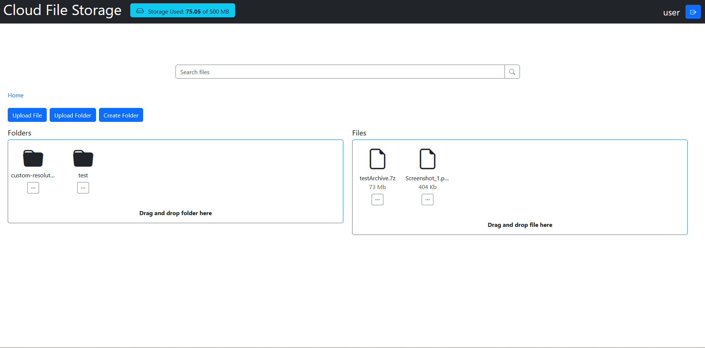
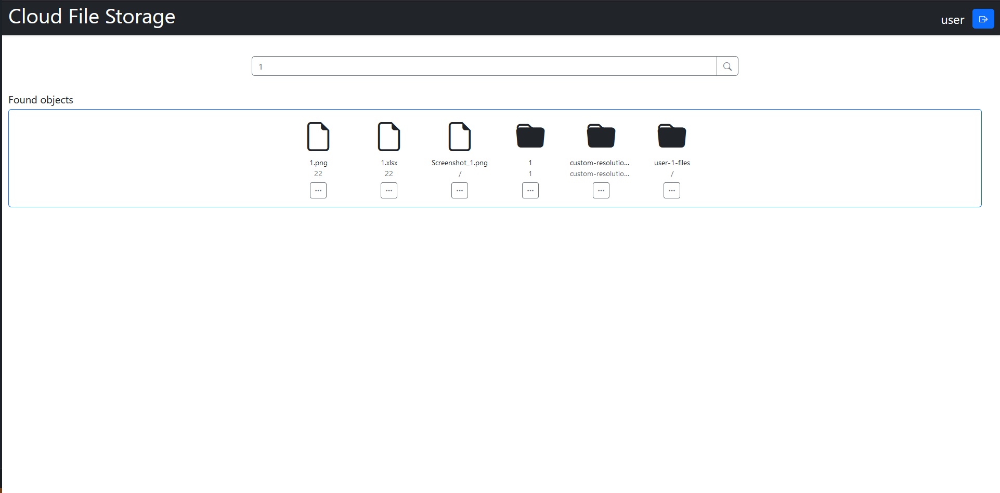
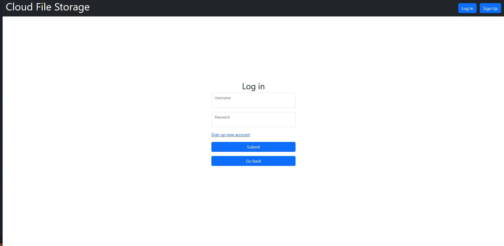

# Cloud-file-storage
Multi-user cloud file storage. Users can upload their files and folders, store it and then download.
## Built with


## Project launch
1. Set up .env file according to this example:
```bash
MYSQL_USER=root
MYSQL_PASSWORD=example
MYSQL_DATABASE=cloud_db
APP_PORT=8081
DB_HOST=db
DB_PORT=3306
DB_NAME=cloud_db
MINIO_ACCESS_KEY=access_key_here
MINIO_SECRET_KEY=secret_key_here
MINIO_CLIENT_ENDPOINT=http://minio:9000
REDIS_PASSWORD=password
REDIS_PORT=6379
REDIS_HOST=redis
```
2. `docker compose up -d`
3. Then go to localhost:9001 and create access & secret keys for minio. (default user/password for minio is `minioadmin/minioadmin`)
4. Set this keys to .env file
5. `docker compose down`
6.  `docker compose up -d` again

App is available at https://localhost:8081/




